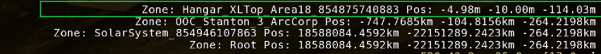
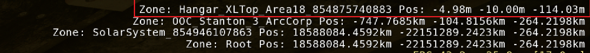

# CircusVOIP

VOIP de proximité privée pour Star Citizen. La voix des joueurs autour
de vous s'entend plus ou moins fort selon leur distance dans le jeu,
calculée à partir de la position lue par OCR sur l'écran du joueur.

## Pour les joueurs

La plupart des joueurs ont uniquement besoin de l'installeur **client** :

➡️ **[Télécharger CircusVOIP_Client_Setup_v0.1.0.exe](../../releases/tag/client-v0.1.0)**

Lancez l'installeur, configurez votre micro, configurez la zone OCR,
définissez les raccourcis radio et profil, connectez-vous au serveur de
votre groupe et c'est parti.

## Pour le serveur

Un groupe a besoin d'**un seul serveur**, hébergé soit :

### Sur le PC d'un joueur (le plus simple)

➡️ **[Télécharger CircusVOIP_Server_Setup_v0.1.0.exe](../../releases/tag/server-v0.1.0)**

Lancez l'installeur, le serveur démarre et génère un mot de passe
automatiquement. Communiquez l'IP de la machine + le mot de passe aux
joueurs.

### Sur une machine dédiée (VPS, PC secondaire, etc.)

Python 3.10+ recommandé. Cloner le repo et lancer les sources :

```bash
git clone https://github.com/kainann/CircusVOIP.git
cd CircusVOIP/server
pip install websockets
python circusvoip_server.py       # serveur positions (port 8888)
python circusvoip_audio_server.py # serveur audio (port 8889)
```

Le mot de passe d'accès est généré automatiquement au premier
lancement dans `circusvoip_server_config.json`. Communiquez-le aux
joueurs avec l'IP publique de la machine.

## Configuration requise

- **Windows 10 ou 11**
- **Star Citizen** lancé pour l'OCR (le client peut tourner sans, mais
  sans position ni proximité ni radio fonctionnels)
- **Un micro**
- **Carte graphique NVIDIA recommandée** : l'OCR (EasyOCR) tourne
  nettement plus vite avec CUDA. Sans GPU NVIDIA, ça fonctionne en CPU
  mais c'est plus lent et plus gourmand.

## Fonctionnalités

### Audio de proximité
Vous entendez les autres joueurs en fonction de leur distance dans Star
Citizen : proche = fort, lointain = faible, inaudible au-delà d'une
portée réglable. La position est lue par OCR sur le HUD du jeu.

### Radio par canaux
Communication longue distance par-dessus la proximité.
L'admin du serveur crée des canaux (ex : « Combat », « Marchand »,
« Général »), chaque joueur en choisit un, et la **touche radio (PTT)**
émet vers tous les joueurs du même canal, peu importe la distance en
jeu. Une touche dédiée permet aussi de **cycler entre les canaux**
rapidement en plein combat.

### Profils
L'admin peut créer et assigner à chaque joueur un **profil** (ex :
« Pilote », « Mineur », « Pirate », « Modo »). Le profil sert à deux
choses :

- **Identification** : vous voyez qui est qui dans la liste des joueurs.
- **Radio par profil** : une touche dédiée émet vers tous les joueurs
  ayant le même profil que vous, peu importe leur canal et leur position.

### Mode RP (Roleplay)
Quand activé, le filtre radio est appliqué sur la voip de proximité
**uniquement si les deux joueurs portent leur casque dans Star
Citizen**. Si l'un des deux porte un casque, le filtre radio est
toujours là, il faut que vous et le joueur en face de vous ne portiez
pas de casque pour enlever le filtre radio.
La détection du casque se fait par OCR du HUD et lecture du gamelog.

Mode RP OFF : filtre radio seulement sur les communications radio et
profil.

### Overlays
Petites fenêtres flottantes par-dessus Star Citizen pour donner des
informations sur CircusVOIP.
Il faut d'abord passer par **Overlay Edition** pour déplacer,
redimensionner et activer les fenêtres souhaitées.

- **Mutes** : état Micro / Proximité / Radio
- **Channel** : canal radio actuel et profil
- **Prox range** : portée de proximité en mètres

Indispensable en fullscreen pour avoir l'info sans alt-tab. Position et
taille sont sauvegardées entre les sessions.

### Mode anonyme (Écran serveur ou Admin)
Permet de masquer son pseudo aux autres joueurs (utile pour des
événements RP).

## Prise en main

### Premier lancement
1. Installez le client et lancez-le.
2. Saisissez l'**adresse IP** et le **mot de passe** du serveur de votre groupe.
3. Choisissez votre **micro** et votre **sortie audio** dans l'onglet Audio.
4. Lancez Star Citizen.

### Calibration de l'OCR
Au premier lancement, définissez la zone soit de façon auto, soit en la
calibrant à la main. **Obligatoire pour faire fonctionner la VOIP.**

Pour calibrer manuellement, vous devez prendre la 1ʳᵉ ligne du
`r_displayinfo 1` comme l'image ci-dessous :




Il faut prendre une zone vide sur la gauche pour anticiper les zones avec les noms longs, conseillé de prendre un peu plus que la longueur du solarsystem

### Touches radio et profil
Dans les paramètres du client, définissez :

- **Touche radio (PTT)** : à maintenir pour parler sur votre canal radio
- **Touche profile radio** : à maintenir pour parler à tous les joueurs
  de votre profil
- **Cycle channel key** : pour changer rapidement de canal sans alt-tab

N'importe quelle touche ou combinaison de 2 touches clavier ou bouton
souris peut être assignée.

## Architecture

Le serveur expose deux services WebSocket distincts :

```
                    ┌────────────────────────┐
                    │      Serveur           │
   ┌──────────┐     │  ┌──────────────────┐  │
   │ Client A │ ◀─▶│  │ Positions  :8888 │  │
   │          │     │  └──────────────────┘  │
   │          │     │  ┌──────────────────┐  │
   │          │ ◀─▶│  │ Audio      :8889 │  │
   └──────────┘     │  └──────────────────┘  │
                    └────────────────────────┘
   ┌──────────┐             ▲    ▲
   │ Client B │ ◀───────────┘───┘
   └──────────┘
```

- **Port 8888** : serveur de positions. Chaque client envoie sa
  position (lue par OCR) et reçoit celles des autres joueurs. Gère
  aussi les canaux radio, les profils joueurs et la console admin.
- **Port 8889** : serveur audio. Relais des trames audio PCM (48 kHz,
  mono, float32) entre clients. Le volume de chaque pair est calculé
  localement par chaque client en fonction de la distance.

Les deux serveurs partagent le même token d'authentification stocké
dans `circusvoip_server_config.json` (généré au premier lancement).

## Crédits

Projet de **Kainan** ([@kainann](https://github.com/kainann)) —
développement assisté par Claude IA ([Anthropic](https://www.anthropic.com)).
