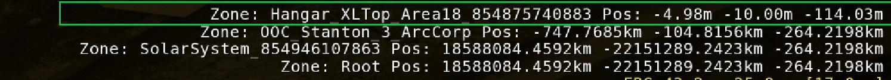
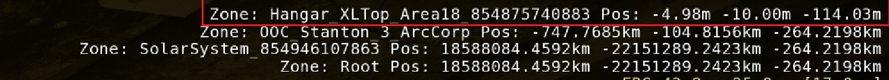

# CircusVOIP

VOIP de proximité privée pour Star Citizen. La voix des joueurs autour
de vous s'entend plus ou moins fort selon leur distance dans le jeu,
calculée à partir de la position lue par OCR sur l'écran du joueur.

Un téléphone intégré, le **CircusPhone**, s'ouvre par-dessus le jeu :
appels et messages par numéro, groupes, missions, urgences, annonces et
mini-jeux.

## Pour les joueurs

La plupart des joueurs ont uniquement besoin de l'installeur **client** :

➡️ **[Télécharger CircusVOIP Client v0.4.0](https://github.com/kainann/CircusVOIP/releases/tag/client-v0.4.0)**

Lancez l'installeur, choisissez votre micro et votre sortie audio,
configurez la zone OCR, saisissez l'adresse et le mot de passe du serveur
de votre groupe, reliez votre compte Discord, et c'est parti. Le détail
est dans [Prise en main](#prise-en-main).

⚠️ **La 0.4 est incompatible avec la 0.3** : le son passe au codec Opus.
Le serveur de votre groupe et tous les joueurs doivent passer en 0.4.0
ensemble.

## Pour le serveur

Un groupe a besoin d'**un seul serveur**.

⚠️ **Depuis la 0.4.0, chaque serveur doit avoir sa propre application
Discord** : chaque joueur relie son compte Discord pour se connecter, et
sans application configurée, personne ne peut entrer. Tout est expliqué
dans le guide : **[docs/INSTALL_SERVEUR.md](docs/INSTALL_SERVEUR.md)**,
section C.

### Sur un PC Windows (le plus simple)

➡️ **[Télécharger CircusVOIP Server v0.4.0](https://github.com/kainann/CircusVOIP/releases/tag/server-v0.4.0)**

L'installeur contient le serveur et la console d'administration. Au
premier lancement, le serveur génère un mot de passe joueurs et un token
d'administration. Configurez ensuite l'application Discord, ouvrez les
ports, et communiquez l'adresse et le mot de passe aux joueurs.

⚠️ **Ouvrir les ports du serveur sur Internet l'expose aux scans
automatiques.** Ce sont 8888 (positions) et 8889 (audio) par défaut,
modifiables dans `circusvoip_server_config.json` — changer les ports par
défaut réduit un peu ce bruit. Le trafic est chiffré par un certificat
TLS auto-signé généré au premier lancement, mais si vous voulez limiter
l'exposition, héberger sur un VPS dédié (3-5 €/mois) est plus prudent
que sur votre PC personnel.

### Sur une machine Linux (VPS, PC secondaire…)

> 📘 **Pour une installation propre et durable** (utilisateur dédié,
> environnement virtuel, services systemd qui redémarrent tout seuls,
> pare-feu, logs), suivez le guide complet :
> **[docs/INSTALL_SERVEUR.md](docs/INSTALL_SERVEUR.md)**, section B.
>
> La méthode ci-dessous est un démarrage rapide : elle convient pour
> tester, mais le serveur s'arrête dès que vous fermez le terminal.

**Python 3.10 ou supérieur requis.**

```bash
git clone https://github.com/kainann/CircusVOIP.git
cd CircusVOIP/server
pip install websockets cryptography
python circusvoip_server.py --headless        # positions (port 8888, wss://)
python circusvoip_audio_server.py --headless  # audio (port 8889, wss://)
```

Lancez-les depuis le dossier `server/` **complet** : le serveur importe
une vingtaine de modules de ce dossier, et un fichier manquant désactive
une fonction sans le dire.

Au premier lancement, le serveur crée `circusvoip_server_config.json`
(mot de passe joueurs, ports) et le certificat TLS. Ajoutez-y ensuite les
deux clés de votre application Discord, puis redémarrez.

### Docker

⚠️ **Les fichiers Docker de `server/` ne sont pas à jour pour la 0.4.**
Les comptes joueurs et les données des applications y sont écrits dans
le conteneur et non dans le volume `/data` : ils seraient **perdus à la
reconstruction de l'image**, c'est-à-dire à la première mise à jour —
numéros réattribués à tout le monde, bannissements effacés. En attendant
une correction, préférez l'installation Linux ci-dessus.

## Configuration requise

- **Windows 10 ou 11** côté client (le serveur tourne aussi sous Linux)
- **Star Citizen** lancé pour l'OCR (le client peut tourner sans, mais
  sans position ni proximité fonctionnelles)
- **Un compte Discord**, pour relier son compte au serveur
- **Un micro**
- **Carte graphique NVIDIA recommandée** : l'OCR (EasyOCR) tourne
  nettement plus vite avec CUDA. Sans GPU NVIDIA, ça fonctionne en CPU,
  mais c'est plus lent et plus gourmand.

### Dépendances Python (installation depuis les sources)

- **Serveur** : `websockets`, `cryptography`. L'échange avec Discord
  n'utilise que la bibliothèque standard.
- **Client** : `PySide6`, `websockets`, `numpy`, `scipy`, `mss`,
  `opencv-python`, `easyocr` (qui installe `torch`), `sounddevice`,
  `cryptography`, `pynput`, et **`opuslib-next`** — sans lui, le client
  ne peut ni émettre ni recevoir de son. `opus.dll` doit rester à côté
  de `circusvoip_opus.py`.

Les installeurs embarquent tout cela : ces listes ne concernent que
l'installation à partir des sources.

## Fonctionnalités

### Audio de proximité
Vous entendez les autres joueurs en fonction de leur distance dans Star
Citizen : proche = fort, lointain = faible, inaudible au-delà de la
portée de proximité (30 m par défaut).
La position est lue par OCR sur le HUD du jeu.

**Dans les vaisseaux**, la voix baisse aussi avec la différence d'étage,
jusqu'à 0 % pour les joueurs situés 3 m au-dessus ou en dessous : on
n'entend que les membres d'équipage de son pont.

Le son voyage au format **Opus**, qui divise la bande passante par plus
de vingt.

### Comptes et numéros
Chaque joueur relie une fois son compte **Discord**, puis le client se
reconnecte seul. Il reçoit un **numéro personnel en 42xxxx**, qui le suit
même s'il change de pseudo : il est affiché dans l'application
**Paramètres** du CircusPhone. Les numéros s'échangent **en jeu** : il
n'existe aucun annuaire public.

### CircusPhone
Un téléphone virtuel s'ouvre en surimpression par-dessus Star Citizen.

- **Navigation entièrement au clavier** : la souris reste captée par Star
  Citizen quand l'overlay est ouvert, vous gardez donc le contrôle de
  votre personnage. **Flèches** pour se déplacer, **Entrée** pour
  sélectionner/valider, **Retour arrière** pour revenir en arrière.
  Espace et ZQSD ne sont jamais interceptées.
- **Raccourcis par défaut** : `F6` ouvrir/fermer le téléphone,
  `F7` décrocher, `F8` refuser/raccrocher, `F9` mute micro,
  `F10` haut-parleur — tous modifiables dans les Paramètres.
  ⚠️ Ces touches ne sont pas bloquées : elles partent **aussi** dans Star
  Citizen. Si elles servent à vos commandes de jeu, réassignez-les.
- Hors connexion, le téléphone affiche **« Réseau non disponible »**.

### Applications du CircusPhone

**Communication**
- **Appels** — clavier de composition et historique.
- **Contacts** — votre carnet, que vous seul remplissez.
- **Messagerie** — textes et images, y compris vers un joueur **hors
  ligne** : le message lui est remis à sa prochaine connexion (conservé
  30 jours côté serveur).
- **Groupes** — conversations à plusieurs.

**Jeu de rôle**
- **Travail** — publiez une mission pour le métier que vous cherchez
  (transporteur, mercenaire, mineur…) et prenez celles qui vous
  concernent.
- **Urgence** — signal de détresse transmis aux secouristes, avec
  position et suivi de la distance.
- **Annonces** — recrutement, événements, ventes. Votre numéro n'y
  figure que si vous le choisissez.

**Utilitaires**
- **Portefeuille** — suivi automatique de vos mouvements d'argent, lus
  depuis le journal du jeu : ventes et achats en boutique, marchandises,
  transferts entre joueurs, locations de véhicules.
- **Blueprints** — vos plans de fabrication débloqués, avec leur recette
  complète : temps de fabrication et matériaux nécessaires.
- **Caméra & Photos** — prenez des clichés par-dessus le jeu ; les
  images reçues en messagerie ont leur propre onglet.
- **Paramètres** — fond d'écran et raccourcis.

Portefeuille et Blueprints relisent aussi les **anciens journaux
archivés** par Star Citizen : vous récupérez ce qui a été obtenu lors de
sessions jouées sans CircusVOIP ouvert.

**Jeux**
- **Valakkar** (le ver des sables) : solo, avec les **meilleurs scores
  partagés** entre tous les joueurs du serveur.
- **Sol VS Terra** (bataille navale) : solo contre l'IA, ou **1v1 avec
  n'importe quel joueur connecté au serveur**.
- **Poker** (Texas Hold'em, 2 à 8 joueurs) : se joue **en proximité
  réelle** — les adversaires doivent être au même endroit en jeu (30 m),
  ce que le serveur vérifie.

### Photos de profil
Vous pouvez associer une photo à votre profil. Elle s'affiche pour les
autres joueurs, qui la reçoivent automatiquement.

### Soundboard
Une planche de sons permet de déclencher un effet audio diffusé aux
autres joueurs. **Un seul son est disponible pour le moment** (alarme).
L'admin peut autoriser ou non chaque profil à l'utiliser.

### Radio par canaux
Communication longue distance par-dessus la proximité.
L'admin du serveur crée des canaux (ex : « Combat », « Marchand »,
« Général »), chaque joueur en choisit un, et la **touche radio (PTT)**
émet vers tous les joueurs du même canal, peu importe la distance en
jeu. Une touche dédiée permet aussi de **cycler entre les canaux**
rapidement en plein combat.

⚠️ **La radio ne fonctionne que si vous avez choisi un canal.** Sans
canal, la touche radio ne fait rien : pas de bip, rien n'est émis, et
votre voix continue de partir en proximité. **Pas de bip, pas de
radio.** La radio est aussi coupée pendant un appel CircusPhone.

### Profils
L'admin peut créer et assigner à chaque joueur un **profil** (ex :
« Pilote », « Mineur », « Pirate », « Modo »). Le profil sert à deux
choses :

- **Identification** : le profil de chaque joueur s'affiche en badge à
  côté de son pseudo, dans la liste des joueurs connectés de la fenêtre
  principale.
- **Radio par profil** : une touche dédiée émet vers tous les joueurs
  ayant le même profil que vous, peu importe leur canal et leur position.
  Elle ne fait rien tant que l'admin ne vous a pas attribué de profil.

### Mode RP (Roleplay)
Quand activé, le filtre radio est appliqué sur la voix de proximité
**dès que l'un des deux joueurs porte son casque dans Star Citizen**.
Pour entendre une voix sans filtre, il faut que vous **et** le joueur en
face ne portiez pas de casque. La détection du casque se fait par OCR du
HUD et lecture du journal du jeu.

Mode RP désactivé : le filtre radio ne s'applique qu'aux communications
radio et profil.

### Masque OCR intelligent
Le client détecte quand votre mobiGlas ou le menu options est ouvert et
adapte la capture en conséquence, ce qui évite les faux relevés de
position pendant ces moments.

### Overlays
Petites fenêtres flottantes par-dessus Star Citizen pour donner des
informations sur CircusVOIP. Passez d'abord par **Overlay Edition** pour
déplacer, redimensionner et activer les fenêtres souhaitées.

- **Mutes** : état Micro / Proximité / Radio
- **Channel** : canal radio actuel et profil
- **Prox range** : portée de proximité en mètres

Indispensable en plein écran pour avoir l'info sans alt-tab. Position et
taille sont sauvegardées entre les sessions.

### Mode anonyme (écran serveur ou admin)
Masque la zone, les coordonnées et la distance des joueurs dans la liste
des joueurs connectés : on voit qui est en ligne, pas où il se trouve.
Utile pour des événements RP.

### Console d'administration
Livrée avec l'installeur serveur :

- **Joueurs, canaux et profils** du serveur
- **Annuaire** des comptes, désignation des chefs médical et sécurité
- **Modération** des annonces et des missions
- **Bannissements** liés au compte Discord, avec la liste des bannis
- **Journaux** : téléchargement de ceux du serveur et de ceux que les
  joueurs choisissent d'envoyer

## Prise en main

### Premier lancement
1. Installez le client et lancez-le.
2. Choisissez votre **micro** et votre **sortie audio** dans l'onglet
   Audio : si Windows ne les expose pas correctement, le client peut se
   rabattre sur un autre périphérique.
3. Saisissez l'**adresse** du serveur de votre groupe (`ip`, ou
   `ip:port` si l'hébergeur a changé les ports) et son **mot de passe**.
4. Reliez votre compte avec le bouton **COMPTE DISCORD** et autorisez la
   liaison dans votre navigateur. Vous recevez votre numéro de téléphone,
   à retrouver ensuite dans l'application **Paramètres** du CircusPhone.
5. **Coupez la VOIP de Star Citizen**, sinon vous entendrez certaines
   voix en double.
6. Lancez Star Citizen.

### Calibration de l'OCR
Au premier lancement, définissez la zone soit de façon automatique, soit
en la calibrant à la main. **Obligatoire pour faire fonctionner la
VOIP.**

Pour calibrer manuellement, vous devez prendre la 1ʳᵉ ligne du
`r_displayinfo 1` comme l'image ci-dessous :




Prenez une zone vide sur la gauche pour anticiper les zones aux noms
longs : il est conseillé de prendre un peu plus que la longueur du
système solaire.

### Touches radio et profil
Choisissez d'abord votre **canal** dans la liste déroulante **Canal** de
la fenêtre principale : sans canal, la touche radio est sans effet. Votre
**profil** s'affiche juste à côté ; c'est l'admin qui l'attribue.

Puis, dans les paramètres du client, définissez :

- **Touche radio (PTT)** : à maintenir pour parler sur votre canal radio
- **Touche profile radio** : à maintenir pour parler à tous les joueurs
  de votre profil
- **Cycle channel key** : pour changer rapidement de canal sans alt-tab

N'importe quelle touche ou combinaison de 2 touches clavier ou bouton
souris peut être assignée.

## Architecture

Le serveur expose deux services WebSocket distincts :

```
                    ┌────────────────────────┐
                    │      Serveur           │
   ┌──────────┐     │  ┌──────────────────┐  │
   │ Client A │ ◀─▶│  │ Positions  :8888 │  │
   │          │     │  └──────────────────┘  │
   │          │     │  ┌──────────────────┐  │
   │          │ ◀─▶│  │ Audio      :8889 │  │
   └──────────┘     │  └──────────────────┘  │
                    └────────────────────────┘
   ┌──────────┐             ▲    ▲
   │ Client B │ ◀───────────┘───┘
   └──────────┘
```

- **Port 8888** : serveur de positions. Chaque client envoie sa position
  (lue par OCR) et reçoit celles des autres joueurs. Gère aussi les
  comptes et la liaison Discord, les canaux radio, les profils, tout le
  CircusPhone (appels, messagerie et file d'attente hors ligne, groupes,
  Travail, Urgence, Annonces, jeux multijoueur), les photos de profil et
  la console d'administration.
- **Port 8889** : serveur audio. Relais des trames audio **Opus** entre
  clients. Le volume de chaque voix est calculé localement par chaque
  client en fonction de la distance.

Les deux ports sont configurables dans `circusvoip_server_config.json`,
qui contient aussi le mot de passe joueurs et les clés Discord.

## Crédits

Projet de **Kainan** ([@kainann](https://github.com/kainann)) —
développement assisté par Claude IA ([Anthropic](https://www.anthropic.com)).
